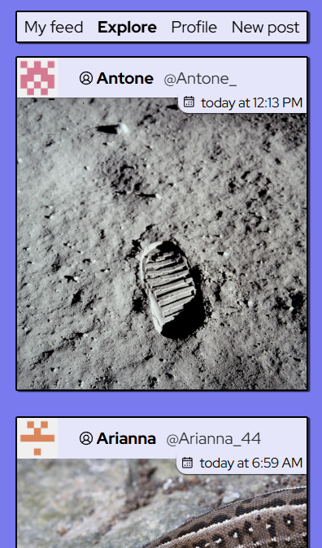

# Odinstagram (Instagram-like social app)

[

](timeline.png)

This is a frontend implementation of [The Odin Project's full stack _Odin-Book_ project](https://www.theodinproject.com/lessons/nodejs-odin-book), using React Router.

It is the final project in the Odin Project's curriculum, and together with [Messaging App](https://github.com/arwin4/messaging-app), is the culmination of everything I've learned during the course.

Visitors can sign up locally, post images, change their avatar, follow other users, comment on posts, and like posts.

Check out [the app's backend](https://github.com/arwin4/odin-book-api), an Express server using MongoDB.

## Some notable features

These are highlights of the frontend only.

- Minimal use of extraneous dependencies. Vanilla CSS.
- Infinite scrolling through posts
- Drag-and-drop image upload with preview
- All instances of fetches are handled through React Router loaders and actions (rather than _useEffect()_)
- Fully keyboard-accessible, all color contrasts WCAG AA(A)
- Works well on any screen size
- Custom _\<dialog>_ component with light dismiss
- Pending styles for buttons, navigation and infinite scroll. (Use devtools throttling to see this.)
- Error handling

No messaging is implemented because I've already made [Messaging App](https://github.com/arwin4/messaging-app).

## Credits

- Spinner icon by [svg spinners](https://github.com/n3r4zzurr0/svg-spinners). Other icons and logo by [Phosphor](https://github.com/phosphor-icons/core). Icons implemented using [Iconify](https://iconify.design/).
- Posts and avatars are uploaded to [Cloudinary](https://cloudinary.com/) and optimized to avif.
- All images used for posts are in the [public domain](https://commons.wikimedia.org/wiki/Featured_Photographs_in_the_Public_Domain).
- Font: [Red Hat Display](https://mckltype.com/red-hat/)
